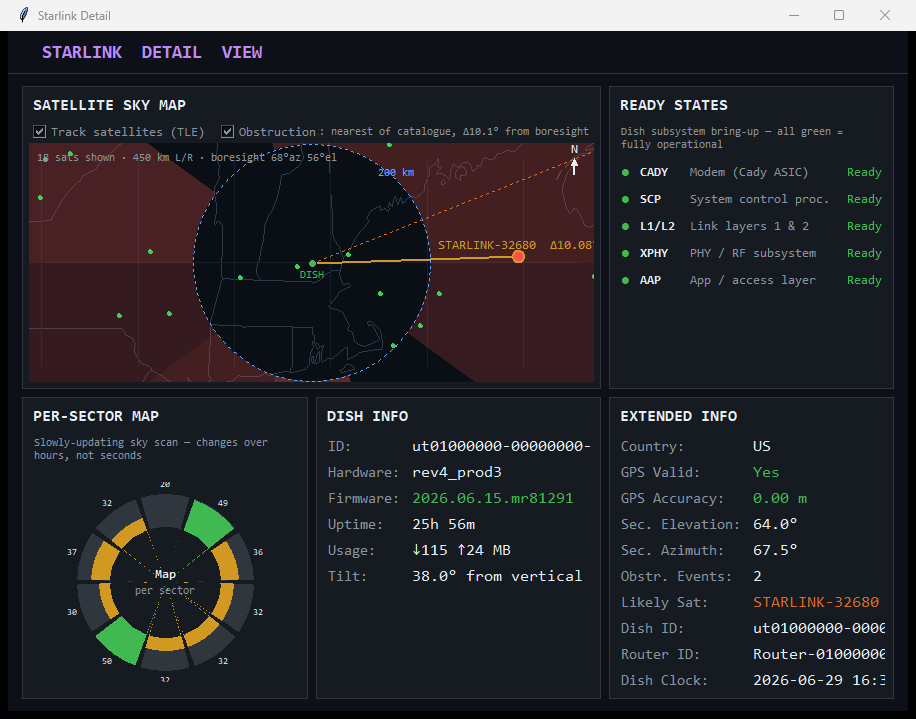

# Starlink Dish Monitor

A standalone Python GUI dashboard for monitoring a Starlink dish in real time.
It connects directly to the dish's **local gRPC API** — no Starlink app, SpaceX
login, or internet account required. Everything stays on your LAN.


The detail window adds dish pointing, tilt, per-sector signal quality, and an
optional "likely satellite" estimate:



---

## Features

**Main window**
- Live metric cards with sparklines: ping latency, packet loss, download, upload, SNR
- Throughput history chart (download + upload overlaid, 20-minute window)
  with a **100-sample moving-boxcar mean** for each stream
- **Status panel:** obstruction events (with age), Ethernet speed, boresight
  elevation/azimuth, SNR, uptime, firmware
- **Location panel** (two columns):
  - *Ground (IP)* — approximate ground-station/PoP location from public IP geolocation
  - *Dish (GPS)* — live dish position from an NMEA GPS receiver or manually-set coordinates
  - Haversine distance between dish and ground station
  - COM-port selector (auto-detect, remembers last port) and Connect / Set-Manual controls
  - **Live 5-line NMEA feed** — the raw serial sentences, auto-scrolling
- Every displayed value is selectable and copyable (Ctrl+C)
- Window text scales with window size; resize freely

**Detail window**
- **Satellite sky map** — a top-down, dish-centred map (coastlines + state/country
  borders + lat/lon grid) that plots every Starlink satellite's sub-point, moving
  in real time as they're re-propagated each poll. The likely satellite is
  highlighted with a line to the dish and its boresight offset. Fixed scale
  (~450 km left/right) with a 200 km reference ring, a boresight bearing line, and
  a north indicator. (Borders come from a one-time cached Natural Earth GeoJSON;
  falls back to a grid if offline.) An optional **obstruction overlay** (toggle)
  shades each azimuth sector of the dish's per-sector map as a translucent wedge in
  the outer band (toward the horizon, where obstructions live), leaving the
  near-overhead area clear; uses Pillow for smooth alpha, with a stippled fallback.
- Per-sector map — 10-segment radial ring chart of the dish's per-sector sky
  scan (field 1028); a slowly-updating map that shifts over hours, not seconds
- Ready-states indicator — each dish subsystem bring-up flag (CADY, SCP, L1/L2,
  XPHY, AAP) shown with a status dot, a plain-language description, and a
  Ready/Down label (all green = fully operational)
- Dish info — hardware/firmware version, uptime, cumulative session data usage,
  and dish tilt from vertical (moved here from the old gauge)
- Extended info — country, GPS validity/accuracy, secondary beam, IDs, dish clock
- **Likely satellite estimate** — *on by default* (toggle via the checkbox in the
  Satellite Sky Map panel). Downloads the public Starlink TLE catalogue from CelesTrak,
  propagates every satellite with SGP4, and reports whichever currently sits
  closest to the dish's reported boresight, with the angular offset (Δ). Needs a
  dish GPS fix (or manual coordinates) plus the `sgp4` + `numpy` packages; if
  those are missing it just shows a hint and the rest of the app is unaffected.
  The estimate is **phase-locked to the dish's beam-handoff schedule**: Starlink
  re-selects the serving satellite on a fixed 15 s grid anchored at :12/:27/:42/:57
  past each minute and holds that choice for the whole window, so the estimator
  re-matches once per window on that same phase (not on a free-running timer) and
  shows a live "next handoff in N s" countdown to when the dish may switch. It is
  still a best-guess — several satellites can share a look-angle, and the dish
  never reveals the real satellite ID.

**Data logging**
- Every poll is appended to a CSV in `data/`, one file per UTC day
  (`data/starlink_YYYY-MM-DD.csv`), covering throughput, latency, loss, SNR,
  pointing, tilt, obstruction events, GPS, the likely-satellite match, the 10
  per-sector map values (for long-term study), and more.

---

## Quick start

1. **Connect to your dish.** Join the Starlink Wi-Fi or plug into the router so the
   dish gateway `192.168.100.1` is reachable. Verify with `ping 192.168.100.1`.
2. **Install Python 3.9+** (developed and tested with **Python 3.11 on Windows 11**;
   the GUI uses `tkinter`, which ships with the standard python.org installer).
3. **Install dependencies:**
   ```bash
   pip install -r requirements.txt
   ```
4. **(Optional) Plug in a USB GPS** receiver that emits NMEA 0183 at 9600 baud and
   note its COM port.
5. **Run it:**
   ```bash
   python starlink_dashboard.py
   ```
6. The main window and a detail window open together. Closing the detail window
   just hides it; closing the main window exits the app.

No `protoc` step is needed — the protobuf schema is embedded in the script and
compiled automatically on first run.

---

## Requirements

| Component | Notes |
|---|---|
| Python 3.9+ | `tkinter` included; tested on 3.11 |
| `grpcio`, `grpcio-tools` | gRPC client + runtime proto compilation |
| `pyserial` | NMEA GPS over a serial COM port |
| `sgp4`, `numpy` *(optional)* | only for the "Likely satellite" TLE estimate |
| A Starlink dish | reachable at `192.168.100.1` over Ethernet or Wi-Fi |
| A USB GPS *(optional)* | any NMEA-0183 receiver as a serial COM port |

All of the above install via `pip install -r requirements.txt`.

---

## Configuration

Edit the constants at the top of `starlink_dashboard.py`:

| Constant | Default | Description |
|---|---|---|
| `DISH_HOST` | `192.168.100.1:9200` | Dish gRPC endpoint |
| `POLL_INTERVAL` | `2` | Status poll interval (seconds) |
| `HISTORY_LEN` | `600` | Sparkline buffer (600 pts × 2 s = 20 min) |
| `HIST_POINTS` | `600` | Throughput-history buffer (20 min) |
| `BOXCAR_N` | `100` | Sample window for the throughput moving mean |
| `HANDOFF_PERIOD` | `15` | Beam-handoff window length the estimator matches on |
| `HANDOFF_OFFSET` | `12` | Seconds past the minute the 15 s handoff grid is anchored to |
| `GPS_PORT` | `COM10` | Default serial port for the GPS receiver |
| `GPS_BAUD` | `9600` | GPS baud rate |

The selected GPS port and any manually-entered dish coordinates are saved to
`location.json` (gitignored) and restored on next launch. Telemetry logs in
`data/` are also gitignored.

---

## How it works (build notes)

- **Transport.** The dish exposes an unauthenticated gRPC service on port 9200
  (`192.168.100.1:9200`). The client calls `Device.Handle` with `get_status` /
  `get_history` requests.
- **Schema.** The API is undocumented. The protobuf definitions live as a
  `PROTO_SRC` string inside `starlink_dashboard.py` and are compiled at runtime
  with `grpcio-tools` into a temp directory — so updating a field number is a
  one-line edit, no build step.
- **Field numbers** were reverse-engineered by raw wire-decoding against firmware
  **2026.05.26** and confirmed unchanged on **2026.06.15**; most telemetry fields
  sit ≈ `+1000` from the legacy community-documented spec.
- **Verified field-mapping corrections** (from wire captures on this firmware):
  - The history array at field `1010` is **not** SNR (it ranges ~16–89, mean ~32),
    so the SNR sparkline is built from live polls only rather than seeded with it.
  - `signal_stats` field 7 (once labelled "obstruction score") is an
    alignment/uncertainty metric, not an obstruction fraction — it swings between
    polls and reads high even with a clear sky, so it is logged raw but not shown
    as obstruction. Obstruction is surfaced via the event count + age instead.
- **GPS.** NMEA sentences are read on a background thread; `$xxGGA` gives fix
  quality + satellite count, `$xxRMC` gives the A/V status, and `*GSV` provides the
  in-view count. A fix auto-populates the dish coordinates.
- **IP geolocation** (via `ip-api.com`) resolves to the Starlink ground
  station / PoP, not the dish's physical location — this is expected.
- **Firmware check.** On the first poll the dish's reported firmware is compared
  against `KNOWN_FIRMWARE` (the build the field numbers were verified against). On
  a match the Dish Info panel shows the version in green; on a mismatch it turns
  orange with a warning that readings may be off — **the dashboard keeps running**.

## Updating for a new firmware

If the orange firmware warning appears, the field numbers *may* have shifted.
The fastest way to re-verify and adapt:

1. **Trust, then verify.** Most firmware bumps don't move field numbers — first
   just check whether the live values still look sane (throughput, SNR, pointing).
   If they do, simply bump `KNOWN_FIRMWARE` to the new build to clear the warning.
2. **If values look wrong, wire-decode the response.** Call `get_status`, run
   `response.dish_get_status.SerializeToString()`, and walk the protobuf
   wire format (field number, wire type, raw bytes) to see which field carries
   which value — `float` fields are 32-bit (wire type 5), sub-messages are
   length-delimited (wire type 2). This is exactly how the current mappings were
   found; a ~40-line decoder is enough.
3. **Edit one place.** All field numbers live in the `PROTO_SRC` string near the
   top of `starlink_dashboard.py`. Change the offending field number(s) there —
   the proto is recompiled at runtime on next launch, so there is no build step.
4. **Re-validate** against the dish and update `KNOWN_FIRMWARE`.

---

## Disclaimer

This tool talks only to your own dish on your local network; it does not contact
SpaceX servers. Field numbers are empirical and may change with firmware. Use at
your own risk.
