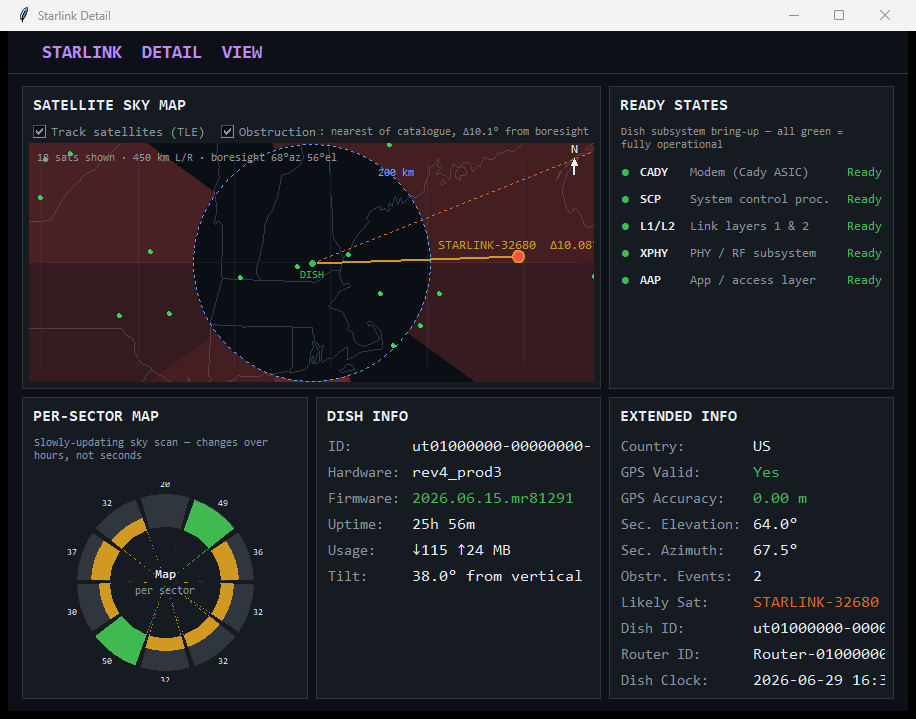

# Starlink Dish Monitor

A standalone Python GUI dashboard for monitoring a Starlink dish in real time.
It connects directly to the dish's **local gRPC API** — no Starlink app, SpaceX
login, or internet account required. Everything stays on your LAN.


The detail window adds dish pointing, tilt, GPS fix status, and an
optional "likely satellite" estimate:



---

## Features

**Main window**
- Live metric cards with sparklines: ping latency, packet loss, download, upload,
  obstruction %
- Throughput history chart (download + upload overlaid, 20-minute window)
  with a **100-sample moving-boxcar mean** for each stream
- **Status panel:** currently-obstructed + obstruction fraction, GPS fix (valid +
  sat count), Ethernet speed, boresight elevation/azimuth, signal vs noise floor,
  uptime, firmware
- **Location panel** (two columns):
  - *Ground (IP)* — approximate ground-station/PoP location from public IP geolocation
  - *Dish (GPS)* — live dish position from an NMEA GPS receiver or manually-set coordinates
  - Haversine distance between dish and ground station
  - COM-port selector (auto-detect, remembers last port) and Connect / Set-Manual controls
  - **Live 5-line NMEA feed** — the raw serial sentences, auto-scrolling
- Every displayed value is selectable and copyable (Ctrl+C)
- Window text scales with window size; resize freely

**Detail window**
- **Satellite sky map** — a top-down, dish-centred map (coastlines + state/country
  borders + lat/lon grid) that plots every Starlink satellite's sub-point, moving
  in real time as they're re-propagated each poll. The likely satellite is
  highlighted with a line to the dish and its boresight offset. Fixed scale
  (~450 km left/right) with a 200 km reference ring, a boresight bearing line, and
  a north indicator. (Borders come from a one-time cached Natural Earth GeoJSON;
  falls back to a grid if offline.)
- Ready-states indicator — each dish subsystem bring-up flag (CADY, SCP, L1/L2,
  XPHY, AAP, RF) shown with a status dot, a plain-language description, and a
  Ready/Down label (all green = fully operational)
- Dish info — hardware/firmware version, uptime, cumulative session data usage,
  and dish tilt from vertical (moved here from the old gauge)
- Extended info — country, GPS fix + satellite count, the dish's desired (target)
  boresight, attitude uncertainty, obstruction fraction, IDs, router
- **Likely satellite estimate** — *on by default* (toggle via the checkbox in the
  Satellite Sky Map panel). Downloads the public Starlink TLE catalogue from CelesTrak,
  propagates every satellite with SGP4, and reports whichever currently sits
  closest to the dish's reported boresight, with the angular offset (Δ). Needs a
  dish GPS fix (or manual coordinates) plus the `sgp4` + `numpy` packages; if
  those are missing it just shows a hint and the rest of the app is unaffected.
  The estimate is **phase-locked to the dish's beam-handoff schedule**: Starlink
  re-selects the serving satellite on a fixed 15 s grid anchored at :12/:27/:42/:57
  past each minute and holds that choice for the whole window, so the estimator
  re-matches once per window on that same phase (not on a free-running timer) and
  shows a live "next handoff in N s" countdown to when the dish may switch. It is
  still a best-guess — several satellites can share a look-angle, and the dish
  never reveals the real satellite ID.

**Data logging**
- Every poll is appended to a CSV in `data/`, one file per UTC day
  (`data/starlink_YYYY-MM-DD.csv`), covering throughput, latency, loss,
  obstruction (fraction + currently-obstructed), pointing, tilt, signal vs noise
  floor, GPS fix, desired boresight, the likely-satellite match, and more.

---

## Quick start

1. **Connect to your dish.** Join the Starlink Wi-Fi or plug into the router so the
   dish gateway `192.168.100.1` is reachable. Verify with `ping 192.168.100.1`.
2. **Install Python 3.9+** (developed and tested with **Python 3.11 on Windows 11**;
   the GUI uses `tkinter`, which ships with the standard python.org installer).
3. **Install dependencies:**
   ```bash
   pip install -r requirements.txt
   ```
4. **(Optional) Plug in a USB GPS** receiver that emits NMEA 0183 at 9600 baud and
   note its COM port.
5. **Run it:**
   ```bash
   python starlink_dashboard.py
   ```
6. The main window and a detail window open together. Closing the detail window
   just hides it; closing the main window exits the app.

No `protoc` step is needed — the protobuf schema is embedded in the script and
compiled automatically on first run.

> **Moving to a new Windows machine (Python not installed)?** Follow
> [docs/INSTALL-Windows.md](docs/INSTALL-Windows.md) — it covers both running the
> packaged `.exe` (no Python) and setting up from source.

---

## Building a Windows executable

You can ship the dashboard as a standalone `.exe` that runs on a Windows 11 machine
with no Python install. `build_exe.py` wraps PyInstaller and handles the one wrinkle
of freezing this app: the embedded protobuf is normally compiled at first run by
invoking `python -m grpc_tools.protoc`, which a frozen exe cannot do. The build
pre-compiles the schema and bundles it; the app detects it is frozen and imports the
bundled modules instead (see the `FROZEN` branch of `ensure_proto_compiled`).

```bash
pip install pyinstaller
python build_exe.py            # -> dist/StarlinkMonitor.exe  (single windowed exe, ~36 MB)
python build_exe.py --console  # keep a console window for startup/debug output
python build_exe.py --onedir   # a folder build (faster launch; no per-run unpack)
```

Notes:
- **Writable files live next to the exe.** On first run the app creates `data/`
  (daily CSV logs, TLE + border caches, `crash.log`) and `location.json` in the
  same folder as `StarlinkMonitor.exe` — not in a temp dir. Put the exe somewhere
  writable (not `C:\Program Files`).
- **One-file vs one-dir.** The single `.exe` is simplest to hand off but unpacks to
  `%TEMP%` on every launch, which is slow from a memory card; `--onedir` (distribute
  the whole `dist/StarlinkMonitor/` folder, e.g. zipped) launches faster.
- Build with the **same Python** you run the app with, so the frozen build matches
  the tested environment. The optional `sgp4`/`numpy`/`Pillow` packages are bundled
  automatically when present, so the satellite sky map works in the exe.

---

## Requirements

| Component | Notes |
|---|---|
| Python 3.9+ | `tkinter` included; tested on 3.11 |
| `grpcio`, `grpcio-tools` | gRPC client + runtime proto compilation |
| `pyserial` | NMEA GPS over a serial COM port |
| `sgp4`, `numpy` *(optional)* | only for the "Likely satellite" TLE estimate |
| A Starlink dish | reachable at `192.168.100.1` over Ethernet or Wi-Fi |
| A USB GPS *(optional)* | any NMEA-0183 receiver as a serial COM port |

All of the above install via `pip install -r requirements.txt`.

---

## Configuration

Edit the constants at the top of `starlink_dashboard.py`:

| Constant | Default | Description |
|---|---|---|
| `DISH_HOST` | `192.168.100.1:9200` | Dish gRPC endpoint |
| `POLL_INTERVAL` | `2` | Status poll interval (seconds) |
| `HISTORY_LEN` | `600` | Sparkline buffer (600 pts × 2 s = 20 min) |
| `HIST_POINTS` | `600` | Throughput-history buffer (20 min) |
| `BOXCAR_N` | `100` | Sample window for the throughput moving mean |
| `HANDOFF_PERIOD` | `15` | Beam-handoff window length the estimator matches on |
| `HANDOFF_OFFSET` | `12` | Seconds past the minute the 15 s handoff grid is anchored to |
| `GPS_PORT` | `COM10` | Default serial port for the GPS receiver |
| `GPS_BAUD` | `9600` | GPS baud rate |

The selected GPS port and any manually-entered dish coordinates are saved to
`location.json` (gitignored) and restored on next launch. Telemetry logs in
`data/` are also gitignored.

---

## How it works (build notes)

- **Transport.** The dish exposes an unauthenticated gRPC service on port 9200
  (`192.168.100.1:9200`). The client calls `Device.Handle` with `get_status` /
  `get_history` requests.
- **Schema.** The protobuf definitions live as a `PROTO_SRC` string inside
  `starlink_dashboard.py` and are compiled at runtime with `grpcio-tools` into a
  temp directory — so updating a field is a one-line edit, no build step.
- **The schema is now taken from the dish's own gRPC server reflection**
  (firmware `2026.08.10.cr84226`), which is authoritative — not the earlier
  reverse-engineered guesses. The dish answers `grpc.reflection`, so you can dump
  the exact `Request`/`Response`/`DishGetStatusResponse` field numbers directly.
  Only the subset the app uses is transcribed.
- **Corrections the reflection dump revealed** (the old wire-decode had these
  wrong, and several panels were showing the wrong field):
  - `obstruction_stats` is field **1004**, not 1015 — and its real metric is
    **`fraction_obstructed`** (0–1), not a non-existent "event count". Field **1015
    is `gps_stats`**, which the app had been reading as obstruction.
  - The numeric **"SNR" was `alignment_stats.tilt_angle_deg`** (dish tilt), not
    signal-to-noise. Numeric SNR is deprecated on this firmware; the real signal
    health is the boolean **`is_snr_above_noise_floor`** (1018). The SNR card is now
    an **Obstruction %** metric, and the status panel shows the signal flag.
  - `pop_ping_drop_rate` is **1003** (the app read 1006, which does not exist).
  - `ready_states` bit numbers were **off by one** (cady is 1, not 2).
  - Field **1028 is `initialization_duration_seconds`**, not per-sector data — so
    the old "Per-Sector Map" card and the sky-map obstruction overlay were removed.
  - History field **1010 is `power_in`** (watts, ~50–110), not SNR.
  - Boresight **1011/1012 are (azimuth, elevation)** — `1011` ~178° (due south, right
    for a northern-hemisphere dish), `1012` ~76°. Reflection confirms it, and read
    correctly the boresight sits ~1° from a real satellite (vs. an impossible ~178°
    "elevation" and an incoherent satellite match before). This also fixed the
    "Likely satellite" estimate, which had been fed the bad elevation.
- **GPS position** (lat/lon) needs the `get_location` request, which returns
  `PERMISSION_DENIED` unless enabled on the dish. GPS **fix status** (valid, sat
  count, filter convergence) is always available via `gps_stats`.
- **GPS.** NMEA sentences are read on a background thread; `$xxGGA` gives fix
  quality + satellite count, `$xxRMC` gives the A/V status, and `*GSV` provides the
  in-view count. A fix auto-populates the dish coordinates.
- **IP geolocation** (via `ip-api.com`) resolves to the Starlink ground
  station / PoP, not the dish's physical location — this is expected.
- **Firmware check.** On the first poll the dish's reported firmware is compared
  against `KNOWN_FIRMWARE` (the build the field numbers were verified against). On
  a match the Dish Info panel shows the version in green; on a mismatch it turns
  orange with a warning that readings may be off — **the dashboard keeps running**.

## Updating for a new firmware

If the orange firmware warning appears, the field numbers *may* have shifted.
The fastest way to re-verify and adapt:

1. **Trust, then verify.** Most firmware bumps don't move field numbers — first
   just check whether the live values still look sane (throughput, obstruction,
   pointing). If they do, simply bump `KNOWN_FIRMWARE` to clear the warning.
2. **If values look wrong, ask the dish for its schema.** The dish supports gRPC
   **server reflection**, so you can dump the authoritative `Request` / `Response`
   / `DishGetStatusResponse` definitions (with exact field numbers) using
   `grpc_reflection` — no guessing. This is how the current `PROTO_SRC` was built.
   (Raw wire-decoding still works as a fallback if reflection is ever disabled.)
3. **Edit one place.** All field numbers live in the `PROTO_SRC` string near the
   top of `starlink_dashboard.py`. Update it from the reflection dump — the proto
   is recompiled at runtime on next launch, so there is no build step.
4. **Re-validate** against the dish and update `KNOWN_FIRMWARE`.

---

## Disclaimer

This tool talks only to your own dish on your local network; it does not contact
SpaceX servers. Field numbers are empirical and may change with firmware. Use at
your own risk.
