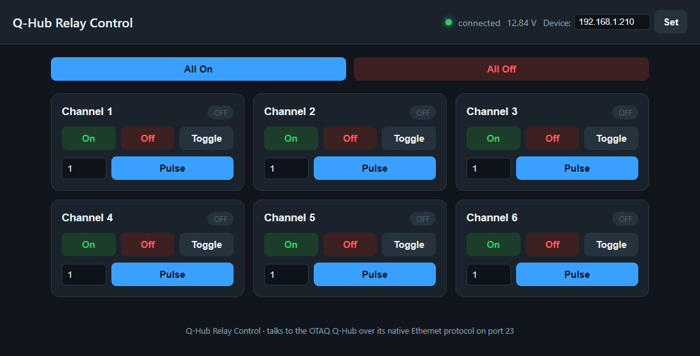

# From Conversation to Confirmation: A Third Case Study in Domain-Expert-Driven Code Generation, and a Prospective Test of the Domain-Expert Specification Schema

**Author:** A. McLeod
**Development assistant:** Claude (Anthropic), Claude Code
**Artifact:** `qhub-relay-control` - <https://github.com/AndyMcLeod/qhub-relay-control>

---

## Abstract

This is a third case study, and it tests the schema differently than the first two did. The artifact is a standalone tool for a Waveshare-class relay board's opposite number: an OTAQ Q-Hub, an underwater Ethernet switch with an onboard power relay, bound for an uncrewed surface vehicle. It has no public protocol documentation at all. The first two papers in this series proposed the Domain-Expert Specification (DES) schema, then tested it by reconstructing it after the fact. This time I opened with it. My first message to the agent was already written in the schema's own seven-slot shape, because I wrote the first two papers and wanted to see what happens when you start from the answer instead of arriving at it. The technical core is again a device that will not tell you the truth for free. The Q-Hub's wire protocol is undocumented, and no amount of polite probing moved it: it accepts one connection at a time and closes on anything it does not recognize within a fraction of a second. The agent broke the deadlock by finding OTAQ's own Windows control utility already installed on my machine and decompiling it, byte for byte, to recover a checksum framing and a command set nobody publishes. It then caught two readings that lie: a set of per-channel status fields that report downstream current, not relay position, and read as "off" no matter what you command with nothing plugged in; and a network-configuration query that returns a placeholder address, confirmed against OTAQ's own application running side by side, not a bug in the reimplementation. With the schema already satisfied on the first line, almost nothing was left to specify. The interaction ran to three turns: the opening request, a blanket grant to implement three extensions the agent had itself proposed, and the request for this paper. I read that gap as the schema's predicted payoff, now observed instead of modeled: a complete specification removes the correction turns, not the discovery turns, because discovery was never something the schema promised to remove. A three-point estimate puts an unaided professional build near 32 person-hours; the AI-coupled work ran to roughly two.

**Keywords:** code generation, large language models, human-AI interaction, requirements specification, reverse engineering, protocol discovery, binary decompilation, end-user programming.

---

## 1. Introduction

The first paper in this series proposed a schema and could only argue for it. The second tested it by grading a finished project against it after the fact. Both left the same question open: what happens if a domain expert opens with the schema instead of reconstructing it later? This paper answers that question directly, because I ran the experiment on myself. My opening message to the agent was written in the schema's seven-slot form, filled in for a new device, before a single line of code existed.

The device is an OTAQ Q-Hub: an underwater Ethernet switch with a built-in power relay, meant to sit in a wet enclosure on an uncrewed surface vehicle and switch power to whatever is plugged into its channels. OTAQ publishes a datasheet. It does not publish a protocol. Reaching the device meant recovering a wire format from nothing, and along the way distrusting two readings that looked plausible and were not. My aims are the same two the first two papers set out: record the artifact honestly, hard part included, then read the transcript against the schema. This time the transcript is short enough to read in full.

---

## 2. The device, and the protocol nobody published

The Q-Hub answers on `192.168.1.210`. A full scan of all 65,535 TCP ports found exactly one open: port 23, plain Telnet's number, but not Telnet. The device accepts one connection at a time. Send it anything it does not recognize and it closes the socket within about seventy milliseconds, no matter what you send: a bare newline, a single byte, a well-formed Modbus-RTU frame addressed to several plausible slave IDs. None of it drew a reply. All of it got the connection dropped. That behavior rules out an ordinary serial-to-Ethernet bridge, which would usually just sit quiet on garbage. It pointed instead to firmware-level command parsing with no tolerance for anything outside its own dialect, and a dialect nobody had written down.

The break came from a different direction. OTAQ ships a Windows utility, `QHub.exe`, and a copy was already installed on the machine I was working from. It is a small .NET Framework 4.7.2 application, unobfuscated. With no .NET SDK on hand, I installed `dnfile` and `dncil`, two pure-Python libraries for reading .NET metadata and disassembling IL, and wrote a short script to walk the binary's method table. A first pass over the string heap turned up literal command fragments: `"MR1#1,relay,"`, `"MR1#1,allon"`, `"MR1#1,setip,"`. A second pass, resolving the actual IL instructions in the button-click handlers, recovered the full picture: a checksum function, a response parser, and the exact format each button assembles before it hits the wire.

The protocol is `$<command>*<CCCC>\r\n`, where `<CCCC>` is a four-digit uppercase hex checksum of `<command>` alone, computed with two running sums held modulo 255, in the pattern of a Fletcher-16 checksum. The command set is small: `MR1#1,all` to query every channel and the sensor block; `MR1#1,relay,<0-5>` to toggle one channel, zero-indexed; `MR1#1,allon` and `MR1#1,alloff`; `MR1#1,ip` to read back the stored network configuration; `MR1#1,setip,<a>.<b>.<c>.<d>.<128|0>` to write a new one. I sent the first hand-built frame to the real device with no dry run. The checksum matched, and the device answered with real telemetry: a supply voltage, six channel states, and a scatter of sensor fields.

Two of those fields lied. The channel-state bits were the first. They read `0` for every channel, no matter which one I toggled, and stayed `0` after `MR1#1,allon`, a command that should force all six on. I first suspected a bad channel index. I ruled that out by toggling all six in turn and diffing full responses; nothing in the state bits ever moved. What did move, faintly, was the supply voltage: it sagged by roughly 0.2 V right after `allon`, consistent with six relay coils actually drawing current with nothing downstream to load them. The state fields, it turned out, report downstream current draw, not relay-contact position. With no load plugged into the bench unit, they will read "off" forever, correctly, because nothing is drawing power on any channel. This is the same shape of trap the second paper in this series found in a Starlink dish's telemetry: a field that is present, plausible, and measuring something other than what its name suggests.

The second lie was smaller and easier to check. `MR1#1,ip` returned `255.255.255.255` with DHCP off, not the device's real, working address. Rather than assume a bug in my own reimplementation, I opened OTAQ's own `QHub.exe`, connected it to the live device, and clicked its Set IP dialog. It showed the identical placeholder. The vendor's own software carries the same quirk, which settles the question: this is how the firmware answers that query, not a defect in the client that asks it. I left the write path (`setip`) implemented against the decompiled protocol, but did not fire it at the real device. A wrong write there could strand the unit off the network once it is sealed inside a wet enclosure, and I had no independent way to confirm success given that the read path already lies.

Neither fact could have been specified in advance. Nobody, including OTAQ's own installed software reading its own protocol, treats the channel-state field or the IP field as reliable in the way their names suggest. Both were settled the only way they could be: by probing the device, reading its replies against an independent source of truth, either the supply voltage or the vendor's own application, and refusing the first plausible answer.

---

## 3. The artifact

The result is a small Python package, `qhub_relay`, plus a `run.py` entry point, built on the standard library alone. A device client (`device.py`) owns the checksum, the framing, and a socket transaction that opens fresh, sends one command, reads one reply, and closes, because the device's one-connection limit rules out holding a socket open. A timed lock serializes all device access so a stuck link fails fast with a clear error instead of queuing silently. A manager layer runs a background poller that caches the last-known state, so the web layer never blocks on the device, and orchestrates momentary pulses as a background thread: turn a channel on, wait, turn it off, with retries on the final off step so a dropped connection at the wrong moment does not leave something energized that should not be. A stdlib-only HTTP server exposes a small JSON API, and a single HTML page renders the control panel: one card per channel with On, Off, Toggle, and a configurable pulse, global All On and All Off, a live connection indicator, editable channel-name placeholders that persist to a config file, and a collapsed "Network settings" panel holding UDP broadcast discovery, the (caveated) network-config query, and the confirmation-gated IP-write control (Figure 1).

*Figure 1. The generated control panel, showing a live connection to the bench unit.*

The whole thing is packaged with PyInstaller into a single `QHubRelayControl.exe`. I copied it alone into an empty directory with no Python installed, ran it, and confirmed it served the panel, talked to the real device, and wrote its own configuration file next to itself on first run.

---

## 4. The interaction as method

The tool came together in three user turns. That is short enough to read whole rather than condense into a table, but I keep the table for continuity with the first two papers.

**Table 1. The development interaction, by turn.**

| # | User input (condensed) | Function | Elicited |
|---|------------------------|----------|----------|
| 1 | Device and interface: OTAQ Q-Hub at 192.168.1.210, switch SX-8370SW01, relay board S0272A. Build a standalone, publishable tool; browser panel with per-channel on/off/toggle/pulse and global all-on/all-off; must tolerate an unreliable link without wedging the device; channel names deferred as placeholders; verify live, or against a model where hardware is unavailable; package as its own public repository with README, license, and screenshot | Specification (schema-formatted) | Initial system; protocol discovery; the full artifact of §3 |
| 2 | Implement all of your recommendations | Delegated scope | Network discovery, IP query, and IP-write, on the agent's own earlier proposal |
| 3 | Write this paper (under "the Design-Expert-Specification paradigm") | Meta | The present document |

Turn 1 is the paper's real subject, so it earns a closer look than a table row gives it. It was not a plain request. It opened with a numbered slot, "Device and interface," naming the device, its address, its manufacturer, and both internal model numbers, then a second slot folding in the operational repertoire, the field context, an explicit authorization to switch relays because the bench unit was unconnected, the deferred channel names, the delivery form, and the verification standard. That is six of the schema's seven slots inside two numbered paragraphs, in language close enough to the first paper's own reusable template that the resemblance is not an accident. I wrote that template. I used it on myself, on a new device, before any code existed, specifically to see what would be left over.

What was left over was turn 2, and it does not fit the taxonomy the first two papers used. It is not a specification, since it names no new requirement. It is not quite authorization, since authorization in the schema's sense grants a verification action, not a scope decision. Having finished the turn-1 artifact, the agent proposed three extensions on its own: network discovery, a network-config query, and an IP-write control, flagging the last as the riskiest of the three because the field it depends on had already been shown to lie. My reply granted all three in five words. What is worth noting is what the agent did with that grant. It implemented the write path faithfully against the decompiled protocol, then declined to exercise it against the real device, on its own judgment, and gated it behind an explicit warning and a confirmation checkbox in the UI. A blanket "yes" to everything you suggested did not read as license to relax the caution it would have applied to a specific, narrower ask. That restraint was not requested. It was inferred from the same safety envelope the opening turn had set for a different, narrower action.

A smaller moment belongs here too, though it produced no table row of its own. Partway through turn 2, the agent asked, outside the running conversation's free text, whether to push the finished code to the public repository it had just created. I said not yet. The bench-testing authorization from turn 1 stayed in force the whole time; the authorization to make the work public did not carry over automatically, and got its own checkpoint. Authorization, in other words, is not a single grant that covers a project. It is renegotiated per action, as the blast radius of what is being authorized changes from a relay on a bench to a public commit.

---

## 5. What the schema removed, and what it could not

The first two papers spent a section asking which turns could have been folded into an earlier one. That question does not apply here in the same form, because turn 1 already was the folded-in version. The more useful question is what happened to the gap the schema was built to close, now that it was closed from the start.

In the first two projects, roughly half the recorded turns were corrections: a missing feature, a deferred packaging step, a requirement that surfaces only once the artifact exists to be argued with. None of that happened here. Turn 2 supplied no correction and no missing requirement; it granted scope the agent had proposed for itself. Turn 3 asked for a document. Between the opening line and a working, tested, packaged tool, there was no space for a specification gap to open up, because the specification did not have one.

What remained was discovery, in three pieces, and none of them were specifiable in advance by anyone. The wire protocol did not exist in writing anywhere I could have pointed the agent to; it had to be pulled out of a binary. The channel-state field's true meaning was not knowable without a working device to toggle and a voltage rail to watch sag. The IP field's placeholder value was not knowable without OTAQ's own software to check it against. This is the schema's central bet, now observed rather than argued: front-loading everything a domain expert already knows removes the correction turns, and only the correction turns, because discovery was never a gap in specification to begin with. It is a gap in what anyone, expert or agent, could have known before the device answered.

---

## 6. The schema, tested from the opening line

The first paper proposed seven slots. The second graded them against a different project after the fact. Here I can grade the same slots against the turn that used them on purpose.

1. **Device and interface.** Filled precisely: address, manufacturer, both internal model numbers. *The model numbers turned out not to matter; decompilation cracked the protocol, not the silkscreen. But naming the manufacturer sent the agent looking for a vendor tool before it tried anything more exotic, and that tool was the whole discovery.*
2. **Operational repertoire.** Filled completely: on, off, toggle, pulse, all-on, all-off, named in the opening line rather than added piecemeal as in the first project. *This is the slot a domain expert can always fill in full, because it is a list of your own hands-on actions, not a design decision.*
3. **Field context and deployment.** Filled: an uncrewed surface vehicle, an unreliable link, must not wedge the device. *This single sentence produced the fresh-connection-per-command design and the timed lock in §3, without either being spelled out.*
4. **Authorization and safety envelope.** Filled for the device: relays may be switched, nothing connected. *Not filled for what came later, the repository's visibility, which needed its own checkpoint mid-project (§4). The slot covers the device. It does not automatically cover everything downstream of the device.*
5. **Deferred parameters.** Filled: channel names, left as placeholders. *Straightforward, and correctly deferred; naming them now would have meant guessing.*
6. **Deliverable and distribution.** Filled: single runnable program, its own public repository, README, license, screenshot. *Collapsed what took three separate turns in the first project into one line here.*
7. **Verification expectation.** Filled: verify live, or against a model if hardware is unavailable. *Hardware was available throughout, so this slot's fallback clause went unused, but its live-verification half did the most work in the paper: the voltage sag and the side-by-side vendor-app check are both instances of it.*

All seven slots were filled, and filling them removed exactly the class of turn the schema claims to remove. The seam is turn 2. The schema has a slot for what you already know you need (2) and a slot for what you will permit the agent to do to a device (4). It has no slot for the case here: the agent, having built the thing, proposes more of it, and you decide how much of that proposal to accept. Calling that authorization stretches slot 4 past what it was built for; authorization is about the device, not about scope the agent invents after delivery. I would add an eighth, optional slot for a schema revision: **delegated scope**, permission for the agent to propose extensions beyond the stated repertoire and, on approval, to implement them under the same safety envelope named in slot 4, not a looser one. Turn 2 is a working example of an agent already behaving that way unprompted. Naming the slot would make it a designed behavior instead of a fortunate one.

---

## 7. How long it took, and how long it might otherwise have taken

I treat duration as effort, in person-hours, not calendar time, following the same method as the first two papers.

### 7.1 Method

For the AI-coupled side, file and commit timestamps bound the work. The first burst, covering the port scan, the decompilation, protocol verification, the full artifact, packaging, and the published repository, shows a packaged executable already built by 16:29 and the initial commit landing at 16:40. The second burst, the delegated-scope extensions and the vendor-app cross-check, opened the vendor's own tool around 08:10 the next morning and closed with a commit at 08:43. Active effort across both, meaning agent generation plus my own reading and direction, comes to roughly ninety minutes to two hours. I report it as an order-of-magnitude bound, not an instrumented figure, and round up.

For the unaided side I estimate with the same three-point (PERT) method as before: expected effort *t*ₑ = (*a* + 4*m* + *b*)/6, standard deviation *σ* = (*b* − *a*)/6, components treated as independent so total variance is the sum of the parts. The baseline is a competent professional developer, a generous comparison given the person who actually directed the work calls himself a non-programmer.

### 7.2 Result

**Table 2. Three-point (PERT) effort estimate for an unaided professional build.** All values in person-hours.

| Work component | *a* | *m* | *b* | *t*ₑ | *σ* |
|----------------|----:|----:|----:|-----:|----:|
| Protocol discovery (dead-end wire probing, acquiring and learning a .NET decompiler, IL analysis, checksum reconstruction, live verification) | 4.0 | 10.0 | 24.0 | 11.33 | 3.33 |
| Device client (framing, checksum, bounded-timeout transactions, connection lock) | 1.0 | 2.5 | 5.0 | 2.67 | 0.67 |
| HTTP server and JSON API (stdlib only) | 1.0 | 2.0 | 4.0 | 2.17 | 0.50 |
| Browser control panel (cards, pulse controls, network-settings panel) | 2.0 | 4.0 | 8.0 | 4.33 | 1.00 |
| State manager (background poller, pulse retries, config persistence) | 1.0 | 2.5 | 5.0 | 2.67 | 0.67 |
| Network discovery, IP query, IP-write (UDP broadcast, vendor-app cross-check) | 1.0 | 2.5 | 6.0 | 2.83 | 0.83 |
| Testing and verification (live toggling, simulated network loss, vendor-app cross-check) | 1.0 | 2.5 | 6.0 | 2.83 | 0.83 |
| Packaging (single-file executable, isolated-directory verification) | 0.5 | 1.5 | 3.0 | 1.58 | 0.42 |
| Publishing (repository, README, license, screenshot) | 0.5 | 1.5 | 3.0 | 1.58 | 0.42 |
| **Total** | | | | **32.0** | **3.9** |

The components total 32.0 person-hours, with a standard deviation of 3.9 h (the total *σ* is the root-sum-square of the component values). A normal approximation puts a 90% interval at roughly 26 to 38 hours, about a working week. Protocol discovery carries both the largest expected value and the widest spread, because an unaided developer has no equivalent of decompiling a vendor's own tool as a shortcut; without that move, the alternative is blind fuzzing against a device that closes the connection on anything it dislikes, which is closer to guesswork than engineering.

### 7.3 Comparison

Against that baseline, the AI-coupled work produced a tested, packaged, published-ready artifact in roughly ninety minutes to two hours, a reduction on the order of sixteen to twenty times. That is a smaller multiple than the first project's twenty-to-thirty, and for a reasonable cause: decompilation is a specialized skill even a competent generalist developer may not already have, which widens the professional-baseline estimate rather than shrinking the AI-coupled one. Set against my actual alternative, the comparison is starker. I am not a developer. An unaided build for me does not start at 32 hours; it starts with learning sockets, binary decompilation, and threading, and the honest endpoints from there are some large multiple of the estimate, or a project that does not get built. For someone in my position the comparison is not "two hours versus thirty-two." It is a working tool against, quite possibly, none.

### 7.4 Threats to validity

The AI-coupled figure is an uninstrumented bound; the unaided figure is a modeled estimate, not a measurement, and both rest on n = 1, now n = 3 across the series but not aggregated into anything more than three separate data points pointing the same way. Three-point estimates drift with the estimator's anchor, and I am the same estimator across all three papers, which is a source of correlated bias I cannot rule out from inside the study. The professional baseline could run either way depending on the developer's prior exposure to .NET reverse engineering specifically; I widened the pessimistic discovery bound to absorb some of that uncertainty. As before, an effort ratio from one small instrument should not be stretched to larger systems, where architecture and maintenance dominate in ways a single conversation does not touch.

---

## 8. Discussion

The division of labor held a third time, and this time under a different test. The first two papers argued the schema would help, then showed it could be reconstructed from a transcript after the fact. This one opened with it and watched what happened. What happened is that the correction turns, the ones that made up roughly half of each earlier project, did not occur. What did not disappear was discovery: the wire protocol, the lying channel-state field, the lying IP field. All three came from probing a device and refusing its first answer, and no specification, however complete, could have supplied any of them, because they were not gaps in what I knew to ask for. They were gaps in what anyone, including OTAQ's own software, could know without running the device and watching it.

One result here is worth more weight than the numbers in §7: I wrote the schema, then used it on myself, unprompted, on a real subsequent project, and it produced the outcome it predicted. That is a different kind of evidence than grading a schema against a transcript, because it shows the pattern is not just something an analyst can find after the fact. It is something a practitioner can pick up and use going in. A method that only works in hindsight is a literary device. One a person reaches for on the next job is closer to a tool.

The agent's own restraint in §4, declining to exercise the IP-write path against real hardware despite a blanket grant to implement it, deserves its own note. A broad authorization ("implement all of your recommendations") did not get read as license to relax the caution a narrower, specific request would have carried. That is a property of this agent's judgment on this occasion, not a property of the schema, and I would not generalize it past n = 1. But it is exactly the kind of behavior the proposed eighth slot, delegated scope, is meant to name and hold in place rather than leave to chance.

The caveats from the first two papers still apply, sharpened by a third repetition rather than dissolved by it. This remains observation, not a controlled trial, and the estimator bias noted in §7.4 is new to this paper and real. The schema still assumes an agent capable of the kind of empirical discovery §2 describes; against a weaker one, slots 4 and 7 give back most of what they promise. Future work is the same paired study the first two papers called for, now with a third grounding case and, worth adding, a fourth condition: not just structured versus unstructured prompting, but a domain expert instructed to write their own opening request in the schema's form versus one left to discover it turn by turn, which is the comparison this paper approximates with a sample size of one author.

---

## 9. Conclusion

A field practitioner opened a project with a fully-formed, seven-slot specification, written from a schema he had proposed in an earlier paper, and watched an agent turn it into a tested, packaged, working tool with almost no further direction. The device's protocol was undocumented and actively resistant to probing; the agent recovered it by decompiling the vendor's own software, then caught two telemetry fields that reported something other than what their names claimed, checking one against a voltage reading and the other against the vendor's own application running side by side. The interaction ran to three turns, where the first two case studies in this series ran to eleven and eighteen. Reading the gap between them, I find the schema did what it was built to do: it removed the specification corrections, not the discovery, because discovery was never the schema's to remove. That is now a finding tested against a live application of the schema, not just an argument for one. Two prior cases pointed the same direction. This one is the first to start from the schema instead of arriving at it, and it arrived at the same place faster.

---

### Materials and reproducibility

The complete artifact, the device client, the manager layer, the web panel, and the packaged executable, is prepared at <https://github.com/AndyMcLeod/qhub-relay-control> under the MIT License. As of this writing the repository has been created and the work committed locally; the push and the tagged release were held pending the author's review, itself an instance of the renegotiated authorization described in §4. The protocol in §2 was recovered by decompiling OTAQ's `QHub.exe` with the `dnfile` and `dncil` Python libraries and verified by hand-computing checksums against the live device's replies. The channel-state field's true meaning was established by toggling every channel, diffing full responses, and cross-referencing a supply-voltage change against the `allon` command. The network-configuration field's placeholder value was confirmed against OTAQ's own application, run against the same live device.

### A note on authorship

The software artifact and a draft of this paper were generated by an LLM coding agent (Claude, Anthropic) under the direction of the human author, whose inputs are reproduced and analyzed in §4. Turn 1, reproduced there in condensed form, was itself written in the form the author's own earlier paper proposed. The paper's self-referential reading of that input, and of the schema it instantiates, should be taken with that provenance in mind.
